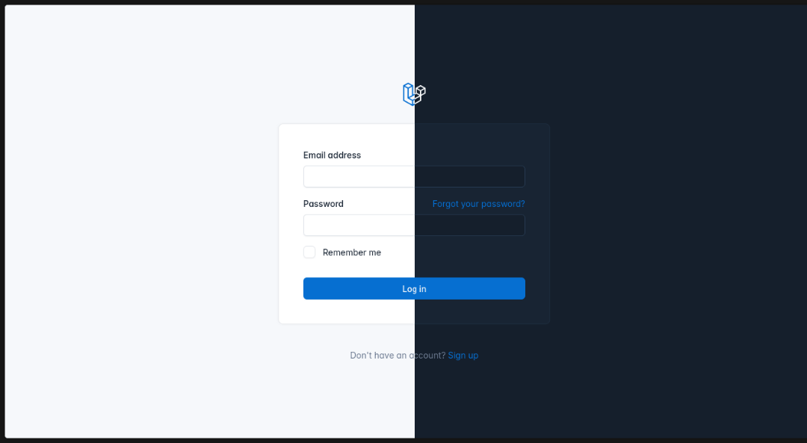

[](https://github.com/SantosVilanculos/cuirass/actions)
[](https://packagist.org/packages/santosvilanculos/cuirass)
[](https://github.com/SantosVilanculos/cuirass/blob/main/LICENSE)



## Introduction

Cuirass is a Laravel application scaffold designed to kickstart your projects with a robust foundation. It combines the visually appealing and responsive Tabler admin dashboard template with the powerful Laravel framework, providing you with everything you need to start building your application immediately.

## Features

- Pre-built authentication system (login, registration, password reset)
- Comprehensive test suite for code quality assurance
- Typed codebase for enhanced reliability via PHP type hinting
- Built on the responsive Tabler admin dashboard template

## Installation

You can quickly get started with Cuirass using either the Laravel installer or Composer:

### Using laravel installer

```sh
laravel new --using santosvilanculos/cuirass your-project-name
```

### Using Composer

```sh
composer create-project santosvilanculos/cuirass your-project-name
```

## License

Cuirass is open-sourced software licensed under the [MIT license](./LICENSE).

## Credits

- [Tabler](https://tabler.io) - Admin Dashboard Template
- [Laravel](https://laravel.com) - PHP Framework
