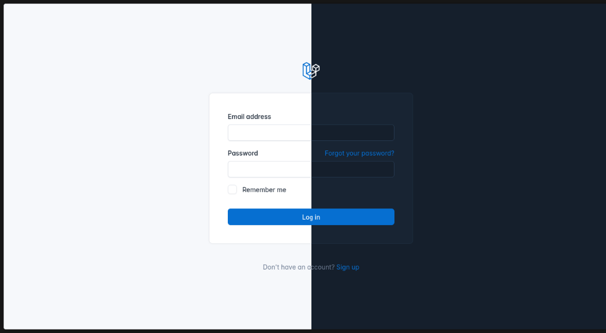

<a href="https://github.com/SantosVilanculos/cuirass/actions">
  <picture>
    <source media="(prefers-color-scheme: dark)" srcset="https://www.shieldcn.dev/github/ci/SantosVilanculos/cuirass.svg?variant=secondary&amp;size=xs&amp;mode=dark&amp;font=geist">
    
  </picture>
</a>
<a href="https://packagist.org/packages/santosvilanculos/cuirass">
  <picture>
    <source media="(prefers-color-scheme: dark)" srcset="https://shieldcn.dev/packagist/v/santosvilanculos/cuirass.svg?variant=branded&amp;size=xs&amp;mode=dark&amp;font=geist">
    
  </picture>
</a>
<a href="https://github.com/SantosVilanculos/cuirass/blob/main/LICENSE">
  <picture>
    <source media="(prefers-color-scheme: dark)" srcset="https://www.shieldcn.dev/github/license/SantosVilanculos/cuirass.svg?variant=ghost&amp;size=xs&amp;mode=dark&amp;font=geist">
    
  </picture>
</a>



## Introduction

Cuirass is a Laravel starter kit built on the Tabler admin dashboard. A solid foundation, ready to build on.

## Features

- Authentication out of the box: login, registration, password reset
- Full test suite
- Typed codebase, PHP type hints throughout
- Tabler admin dashboard included

## Installation

Using the Laravel installer:

```sh
laravel new --using santosvilanculos/cuirass your-project-name
```

Using Composer:

```sh
composer create-project santosvilanculos/cuirass your-project-name
```

## License

MIT licensed. See [LICENSE](./LICENSE).

## Credits

- [Tabler](https://tabler.io), admin dashboard template
- [Laravel](https://laravel.com), PHP framework
